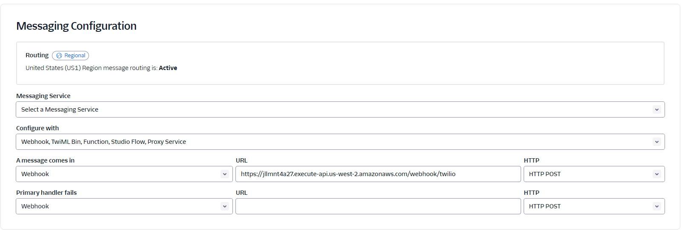

# Setting Up a New Customer
1. Get the customer a twilio phone number that can send and receive text messages.
2. In Twilio configure a webhook message to the prod url when text messages are received. 

For example, the current prod twilio webhook url is `https://jllmnt4a27.execute-api.us-west-2.amazonaws.com/webhook/twilio`
NOTE: Do not configure a backup webhook url or it can lead to multiple messages being sent on cold starts.

3. In this repo, configure a new account and conversation configuration in AccountClient. We are
storing these in code now but will eventually move them to a DB in the appropriate environment. 

Example
`{
accountId: "2",
accountName: "American Summer Camps",
internalPhoneNumber: "+18773941817", // The number you configured in step 1 and 2
conversationConfiguration: {
firstMessage:
"Welcome to the video portion of your ASC application!\n" +
"INSTRUCTIONS: Please text us an informal, 30 second selfie-video using your phone 🤳\n" +
"PROMPT: Introduce yourself, skills/experience, and why you want to work at camp! 🏕️\n" +
"Then you’re done! ✅\n" +
"Text STOP to opt out anytime.",
expectedResponseType: ContentTypes.VIDEO,
lastMessage: "Thank you! From here, we will share your profile with summer camps that have open roles and are currently hiring. Camp Directors will reach out to you directly to initiate the hiring process. 🥳\n" +
"If anything comes up, please send us a note at hello@americansummercamps.com",
accountId: "2"
}
}`

It is important that the accountPhoneNumber follows the +########### format.    

4. Send a text message to the configured number and verify the conversation configuration works
as expected.